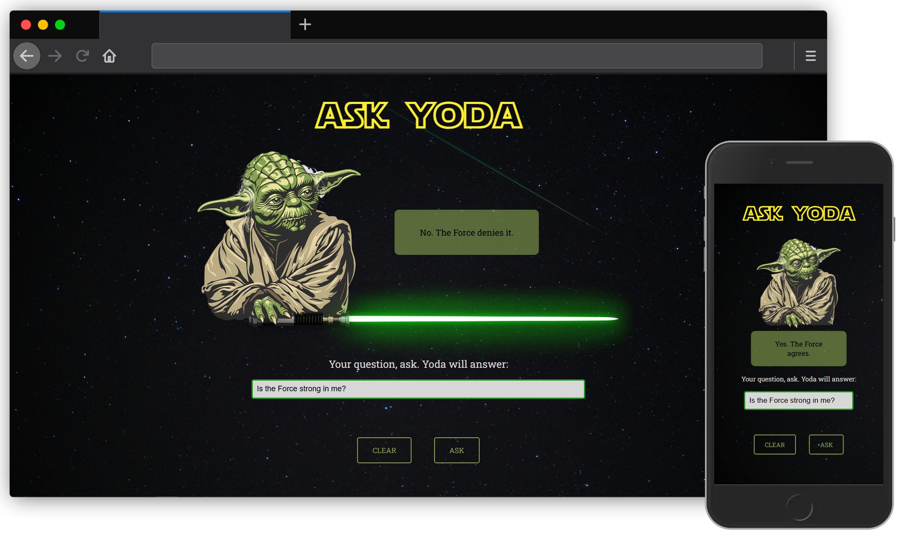
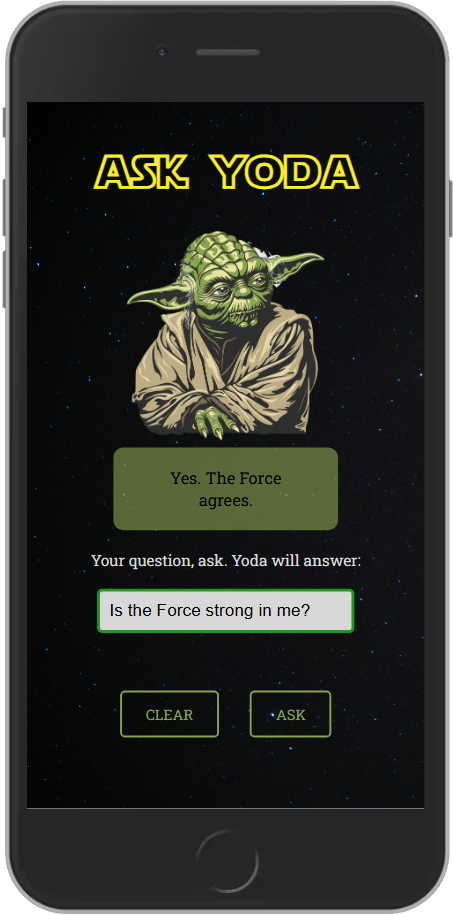

# 👽 Ask Yoda

A small front-end app where you can ask Master Yoda any question, and receive a wise (or mysterious) answer. My own version of popular "Magic 8Ball", built for fun, practice, and with a touch of the Force!

## 📷 Preview

## Table of contents

- [Features](#features)
- [Technologies Used](#technologies-used)
- [JavaScript Features](#javascript-features)
- [Live](#live)
- [Credits](#credits)

## ✨ Features

- Ask questions and get random Yoda-style responses
- Light interaction with audio — Yoda laughs on hover
- Responsive design (works on mobile, tablet, and desktop)
- Styled with SCSS and custom Star Wars fonts

## 🛠 Technologies used

- HTML5
- SCSS (CSS3)
- JavaScript (Vanilla)
- Web Fonts & Audio
- Photoshop (for merged images)

## 🧠 JavaScript Features

This project includes the following JavaScript functionality:

- `Event listeners` for buttons, input field and mouse hover
- `Keyboard support` – pressing `Enter` triggers the same logic as clicking the "Ask" button
- `Validation logic` to check if the input ends with a question mark and is not empty
- `Random answer generator` using `Math.random()` and `Math.floor()` to pick from a Yoda-style answers array
- `Audio playback` on hover using the `Audio()` object and `.play()` method
- Dynamic manipulation of DOM elements with `.textContent`, `.value`, and `.style.visibility`

## 💻 Live

Here is a working live demo: <!-- add later  -->

## 📚 Credits

This project is for educational purposes. Star Wars and Yoda are © Lucasfilm / Disney — used here only in a fan-made context.

#### Graphics

- Yoda image: [CleanPng](https://www.cleanpng.com/png-star-wars-yoda-character-in-green-hooded-robe-smil-8038984/)
- Lightsaber graphic: [PngWing](https://www.pngwing.com/en/free-png-vcebu)
- Galaxy background by [Lars Mai](https://www.pexels.com/@larsmai/) via [Pexels](https://www.pexels.com/photo/a-starry-dark-sky-at-night-time-9190535/)
- Yoda with Lightsaber: Yoda image & Lightsaber graphic merged by me in Photoshop

#### Audio

- Yoda laugh sound: "Yoda Laugh" - available on [Voicy](https://www.voicy.network/official-soundboards/movies/yoda)

#### Fonts

- Star Jedi font: by [Boba Fonts](https://www.dafont.com/boba-fonts.d150) - available on [Dafont](https://www.dafont.com/star-jedi.font)
